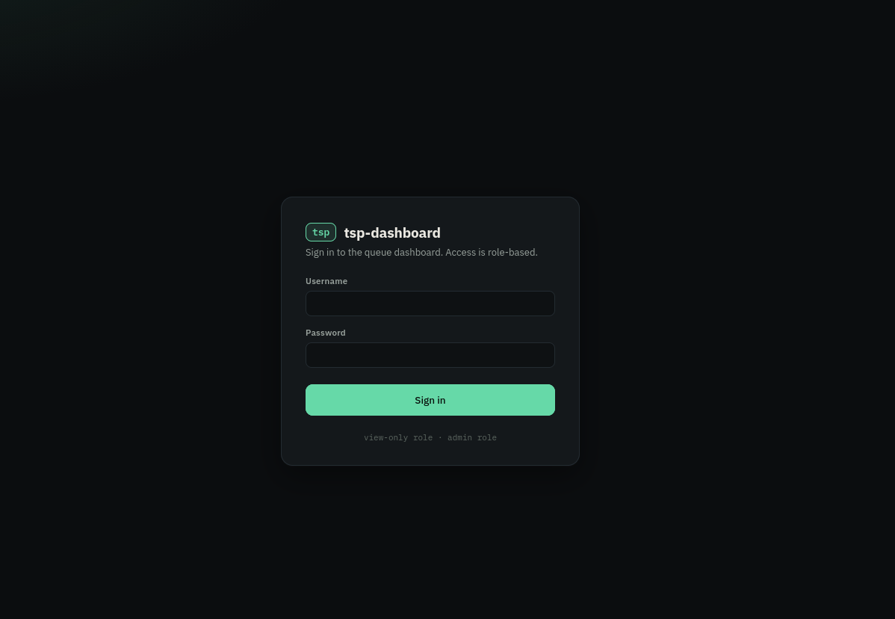
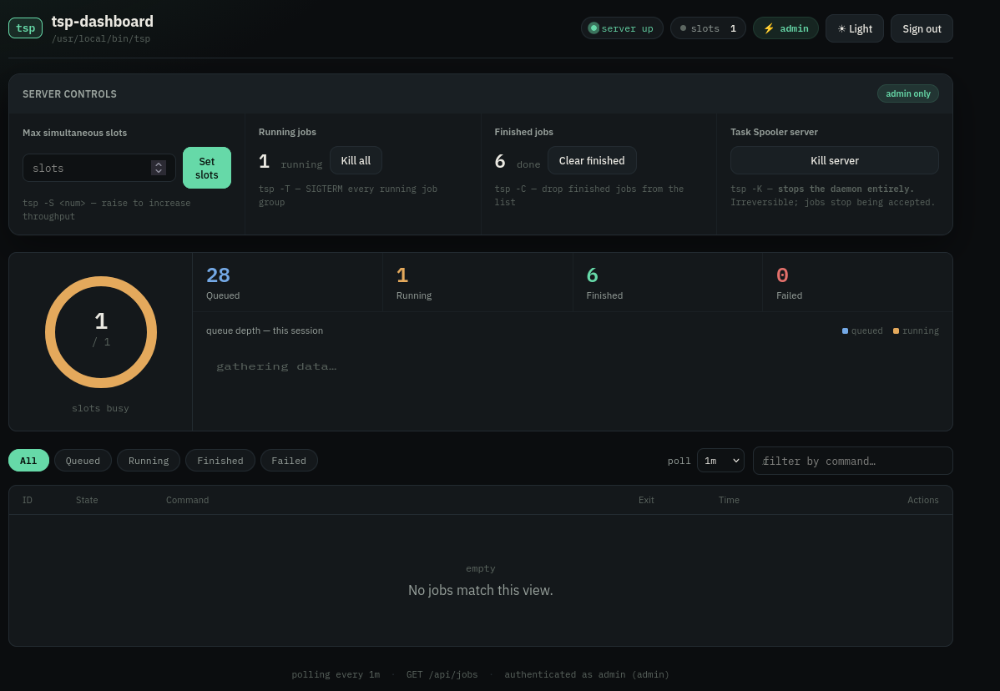
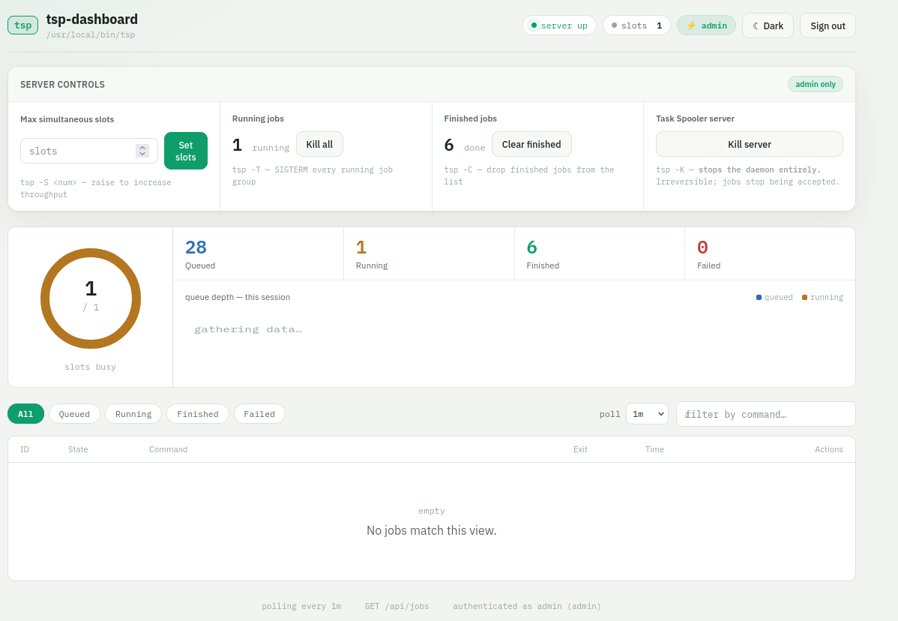

# tsp-dashboard

A production-grade web dashboard for [Task Spooler](https://viric.name/cgi-bin/ts)
(`tsp` / `ts`), the Unix task queue. It wraps the `tsp` CLI behind a small,
role-aware REST API and serves a responsive single-page frontend with
**dark/light** themes and **role-based access** (admin vs. view-only).

   

---

## Features

- **Role-based login**
  - `admin` — full access: view jobs **and** run every control action. 
  - `viewer` — read-only: list jobs, open job info / output, see server state. Every mutating endpoint returns `403`.
- **Dashboard** — live-updating job table, state badges, exit codes, drawer with full `tsp -i` info and `tsp -c` output, queue-depth trend chart, slot-usage ring.
- **Dark & light themes** — manual toggle (persisted) and automatic `prefers-color-scheme` detection.
- **Admin server controls** (mapped to `tsp` actions):

| Action                    | `tsp` command            | Notes                                              |
|---------------------------|--------------------------|----------------------------------------------------|
| Set / raise slots         | `tsp -S <num>`           | Increase concurrent job throughput                 |
| Kill a running job        | `tsp -k <id>`            | SIGTERM to the job's process group                 |
| Remove a queued/finished job | `tsp -r <id>`          | Drop it from the list                              |
| Bump a queued job → front | `tsp -u <id>`            | Move to the head of the queue                      |
| Swap queue positions      | `tsp -U <a>-<b>`         | Fine-grained reordering with the ↑ button          |
| Kill *all* running jobs   | `tsp -T`                 | SIGTERM every running job group                    |
| Clear finished jobs       | `tsp -C`                 | Prune the list                                     |
| **Kill the server**       | `tsp -K`                 | Stops the daemon entirely (double confirm `KILL`)  |

- **Production posture** — systemd units with hardening, gunicorn workers,
  PBKDF2-hashed credentials, session cookies with `HttpOnly`/`SameSite=Lax`,
  brute-force login throttling, security response headers, and a dedicated
  non-root runtime user. 

---

## Screenshots

Drop your captures into a `screenshots/` directory and update the paths
below to match your filenames:







---

## Quick start (systemd)

Run the installer as root (creates the `tspd` user, copies the app to
`/opt/tsp-dashboard`, builds a virtualenv, writes `/etc/tsp-dashboard.env`,
and starts the service):

```bash
sudo ./scripts/install_service.sh
```

Then set the real secret and restart:

```bash
# generate a strong secret if you like
openssl rand -hex 32

sudo $EDITOR /etc/tsp-dashboard.env      # set TSPD_SECRET_KEY
sudo systemctl restart tsp-dashboard
sudo systemctl status tsp-dashboard
```

Seed the users file (hashed, PBKDF2) — the dashboard reads users from
`TSPD_USERS_FILE` only:

```bash
sudo -u tspd /opt/tsp-dashboard/.venv/bin/python \
    /opt/tsp-dashboard/manage.py --file /data/users.json \
    add-user --username admin --role admin --force
sudo -u tspd /opt/tsp-dashboard/.venv/bin/python \
    /opt/tsp-dashboard/manage.py --file /data/users.json \
    add-user --username viewer --role viewer --force
```

Open <http://localhost:8766> (or your server's address) and sign in.

### Optional: persistent task-spooler daemon

The dashboard auto-starts the `tsp` daemon on its first request. If you want
a dedicated daemon (e.g. pre-seeded at boot), enable the companion unit:

```bash
sudo systemctl enable --now task-spooler.service   # starts `tsp -S 2`
```

Both services share `/data` (socket + job output) under the `tspd` user.
Tune the slot count in `systemd/task-spooler.service`.

### Manual (no systemd)

```bash
python3 -m venv .venv && . .venv/bin/activate
pip install -r requirements.txt
cp .env.example .env          # optional — .env is auto-loaded if present
python3 manage.py add-user --username admin --password '…' --role admin
python3 manage.py add-user --username viewer --password '…' --role viewer
python3 run.py        # http://127.0.0.1:8766
```

---

## Configuration

All runtime settings come from environment variables (set via
`/etc/tsp-dashboard.env` when running as a service). For local dev a
`.env` file in the project root is loaded automatically; real
environment variables always take precedence.

| Variable                          | Default            | Purpose                                             |
|-----------------------------------|--------------------|-----------------------------------------------------|
| `TSPD_SECRET_KEY`                 | *(ephemeral)*      | Session-signing key. Set a stable secret in prod.   |
| `TSPD_USERS_FILE`                 | `users.json`       | Path to the user database (JSON) — the only source of users. |
| `TSPD_BIND_HOST`                  | `127.0.0.1`        | gunicorn bind address.                             |
| `TSPD_PORT`                       | `8766`             | gunicorn / dev-server port.                        |
| `TSPD_WORKERS` / `TSPD_THREADS`   | `2` / `4`          | gunicorn settings.                                 |
| `TSPD_LOG_LEVEL`                  | `info`             | gunicorn log level.                                 |
| `TSPD_COOKIE_SECURE`              | `false`            | Set `true` behind TLS for `Secure` cookies.         |
| `TSPD_LOGIN_MAX_ATTEMPTS`         | `10`               | Failed attempts permitted per window.               |
| `TSPD_LOGIN_WINDOW_SECONDS`       | `300`              | Login-throttle window.                              |
| `TSP_BIN`                         | *(auto-detect)*    | Override the `tsp` binary path.                     |
| `TS_SOCKET` / `TMPDIR`            | *(tsp defaults)*   | Inherited by the `tsp` client to reach the daemon.  |

### User database

Passwords are stored as salted PBKDF2 hashes. Manage them with
`manage.py`:

```bash
python3 manage.py add-user --username alice --role admin
python3 manage.py add-user --username bob   --role viewer
python3 manage.py list-users
python3 manage.py remove-user --username bob
```

`users.json` is gitignored; `users.example.json` documents the schema.

---

## API reference

All endpoints (except `POST /api/login`) require an authenticated session.

| Method | Path                              | Roles     | Description                              |
|--------|-----------------------------------|-----------|------------------------------------------|
| GET    | `/api/me`                         | any       | Current session: `{user, role}`          |
| POST   | `/api/login`                      | public    | Start a session                          |
| POST   | `/api/logout`                     | any       | End the session                          |
| GET    | `/api/jobs`                       | any       | Jobs, counts, slots, server alive state  |
| GET    | `/api/info`                       | any       | tsp binary, slots, version, alive flag   |
| GET    | `/api/server/status`              | any       | `{server_alive}` (healthcheck)           |
| GET    | `/api/jobs/<id>/info`             | any       | `tsp -i <id>` detail                     |
| GET    | `/api/jobs/<id>/output`           | any       | `tsp -c <id>` output (tail, capped)      |
| POST   | `/api/jobs/<id>/cancel`           | admin     | `{action: kill\|remove}` (`-k`/`-r`)     |
| POST   | `/api/jobs/<id>/bump`             | admin     | `tsp -u <id>` — front of queue           |
| POST   | `/api/jobs/swap`                  | admin     | `{a, b}` — `tsp -U a-b`                  |
| POST   | `/api/slots`                      | admin     | `{slots}` — `tsp -S <n>`                 |
| POST   | `/api/kill-all`                   | admin     | `tsp -T`                                 |
| POST   | `/api/clear`                      | admin     | `tsp -C`                                 |
| POST   | `/api/server/kill`                | admin     | `tsp -K` — stop the daemon               |

---

## Development

```bash
pip install -r requirements-dev.txt
pytest -q              # runs the full API suite against a fake tsp
python3 run.py
```

Tests use `tests/fake_tsp.py`, a small in-memory emulator of the `tsp`
CLI (selected via `TSP_BIN`), so nothing real is touched.

### Layout

```
app/
  __init__.py   # Flask app factory, security headers
  config.py     # env-driven configuration
  auth.py       # user store, password hashing, role decorators
  tsp.py        # TaskSpooler client (parsing + tsp commands)
  api.py        # REST API blueprint (role-aware)
  web.py        # serves the frontend
static/index.html
systemd/
  tsp-dashboard.service   # main dashboard unit
  task-spooler.service    # optional persistent tsp daemon
scripts/install_service.sh  # one-shot systemd installer
gunicorn.conf.py          # production server config (env-driven)
manage.py       # user management CLI
run.py          # dev server
wsgi.py         # gunicorn entrypoint
tests/          # pytest suite + fake tsp
```

---

## Deployment notes

- The dashboard service binds to `127.0.0.1:8766` by default. Put it behind
  a reverse proxy (nginx / Caddy / Traefik) with TLS and set
  `TSPD_COOKIE_SECURE=true`.
- Logs land in the journal: `journalctl -u tsp-dashboard -f`.
- The service runs hardened (`NoNewPrivileges`, `PrivateTmp`,
  `ProtectSystem=strict`, `ProtectHome=true`); only `/data` is writable.
- To control the **host's** task-spooler daemon instead of a per-user one,
  point `TS_SOCKET` at the existing socket (e.g. `TS_SOCKET=/tmp/ts.socket`)
  and make sure the service user can read/write that socket.
- Rotate/regenerate `TSPD_SECRET_KEY` if it is ever leaked — it signs all
  sessions.
- The login throttle keys on the `X-Forwarded-For` client IP; only trust it
  if your proxy sets it.

## License

[GPL-3.0](LICENSE)
