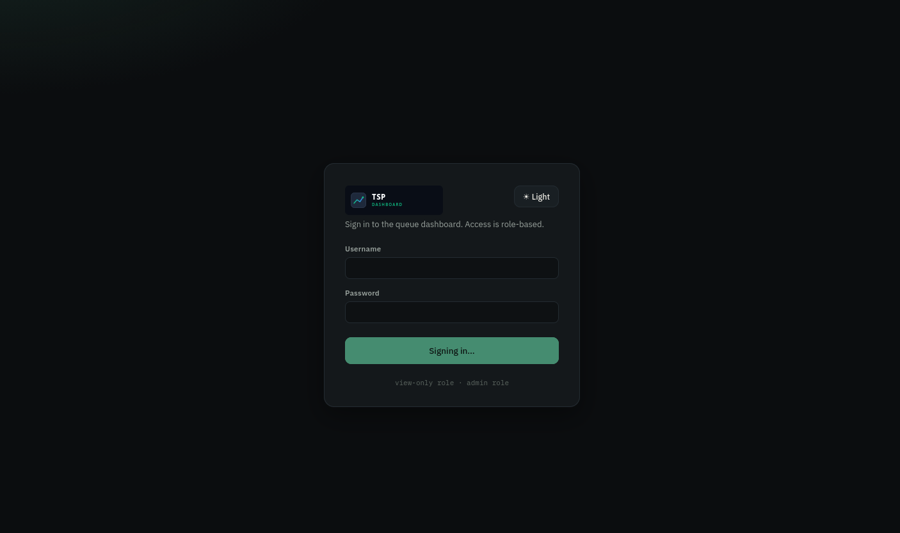
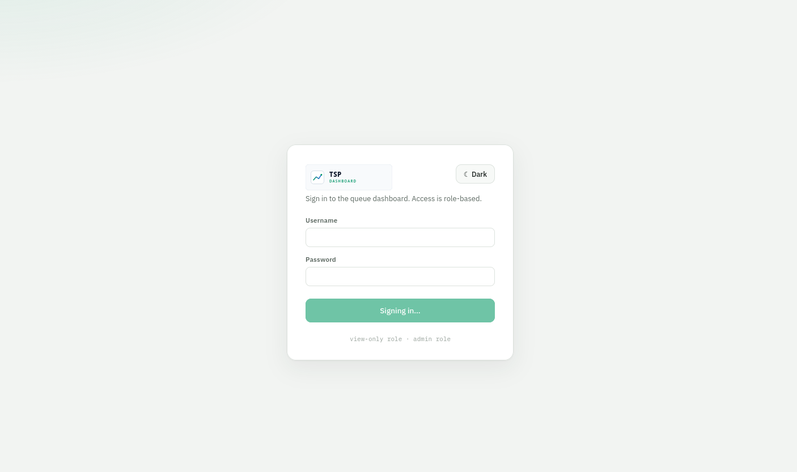
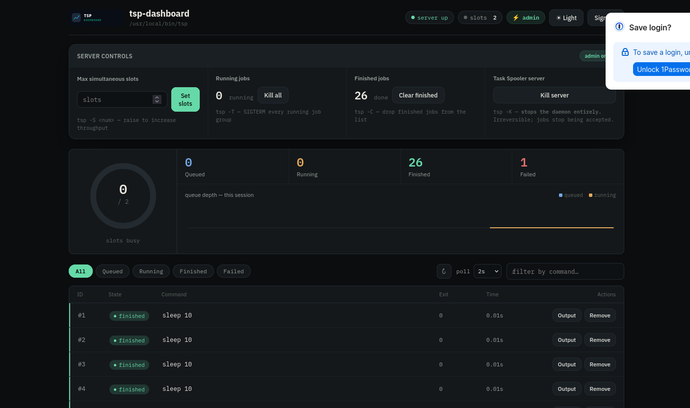
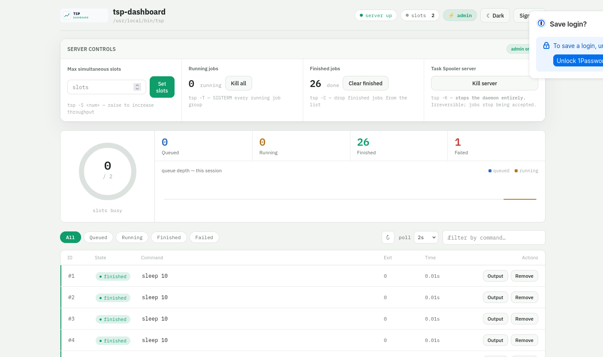

# tsp-dashboard

<p align="center">
  
  
</p>

A production-grade web dashboard for [Task Spooler](https://viric.name/cgi-bin/ts)
(`tsp` / `ts`), the Unix task queue. It wraps the `tsp` CLI behind a small,
role-aware REST API and serves a responsive single-page frontend with
**dark/light** themes and **role-based access** (admin vs. view-only).

[](https://www.python.org/)
[](https://flask.palletsprojects.com/)
[](https://systemd.io/)
[](https://gunicorn.org/)

---

## Features

- **Role-based login**
  - `admin` — full access: view jobs **and** run every control action.
  - `viewer` — read-only: list jobs, open job info / output, see server state. Every mutating endpoint returns `403`.
- **Dashboard** — live-updating job table, state badges, exit codes, drawer with full `tsp -i` info and `tsp -c` output, queue-depth trend chart, slot-usage ring.
- **Dark & light themes** — toggle directly on the **login page** or in the header; your choice is stored in `localStorage`, persists from the login screen into the application (and back again on logout), and is reflected in the themed `logo-dark.svg` / `logo-light.svg` branding. Automatic `prefers-color-scheme` detection is the default.
- **Admin server controls** (mapped to `tsp` actions):

    | Action                    | `tsp` command            | Notes                                              |
    |---------------------------|--------------------------|----------------------------------------------------|
    | Set / raise slots         | `tsp -S <num>`           | Increase concurrent job throughput                 |
    | Kill a running job        | `tsp -k <id>`            | SIGTERM to the job's process group                 |
    | Remove a queued/finished job | `tsp -r <id>`          | Drop it from the list                              |
    | Bump a queued job → front | `tsp -u <id>`            | Move to the head of the queue                      |
    | Swap queue positions      | `tsp -U <a>-<b>`         | Fine-grained reordering with the ↑ button          |
    | Kill *all* running jobs   | `tsp -T`                 | SIGTERM every running job group                    |
    | Clear finished jobs       | `tsp -C`                 | Prune the list                                     |
    | **Kill the server**       | `tsp -K`                 | Stops the daemon entirely (double confirm `KILL`)  |

- **Production posture** — systemd units with hardening, gunicorn workers,
  PBKDF2-hashed credentials, session cookies with `HttpOnly`/`SameSite=Lax`,
  brute-force login throttling, security response headers, and a dedicated
  non-root runtime user.

---

## Screenshots

| Login — dark                                    | Login — light                                    |
|-------------------------------------------------|--------------------------------------------------|
|  |  |

| Dashboard — dark                                   | Dashboard — light                                   |
|----------------------------------------------------|-----------------------------------------------------|
|         |        |

---

## Quick start

### systemd install

Run the installer as root (creates the `tspd` user, copies the app to
`/opt/tsp-dashboard`, builds a virtualenv, writes `/etc/tsp-dashboard.env`,
and starts the service):

```bash
sudo ./scripts/install_service.sh
```

Then set the real secret and restart:

```bash
# generate a strong secret if you like
openssl rand -hex 32

sudo $EDITOR /etc/tsp-dashboard.env      # set TSPD_SECRET_KEY
sudo systemctl restart tsp-dashboard
sudo systemctl status tsp-dashboard
```

Seed the users file (hashed, PBKDF2) — the dashboard reads users from
`TSPD_USERS_FILE` only:

```bash
sudo -u tspd /opt/tsp-dashboard/.venv/bin/python \
    /opt/tsp-dashboard/manage.py --file /data/users.json \
    add-user --username admin --role admin --force
sudo -u tspd /opt/tsp-dashboard/.venv/bin/python \
    /opt/tsp-dashboard/manage.py --file /data/users.json \
    add-user --username viewer --role viewer --force
```

Open <http://localhost:8766> (or your server's address) and sign in.

!!! tip "Persistent task-spooler daemon"

    The dashboard auto-starts the `tsp` daemon on its first request. If you
    want a dedicated daemon (e.g. pre-seeded at boot), enable the companion
    unit:

    ```bash
    sudo systemctl enable --now task-spooler.service   # starts `tsp -S 2`
    ```

    Both services share `/data` (socket + job output) under the `tspd` user.
    Tune the slot count in `systemd/task-spooler.service`.

### Manual (no systemd)

```bash
python3 -m venv .venv && . .venv/bin/activate
pip install -r requirements.txt
cp .env.example .env          # optional — .env is auto-loaded if present
python3 manage.py add-user --username admin --password '…' --role admin
python3 manage.py add-user --username viewer --password '…' --role viewer
python3 run.py        # http://127.0.0.1:8766
```

---

## Building the docs

```bash
pip install -r requirements-dev.txt
mkdocs build
mkdocs serve                # http://127.0.0.1:8000
```

---

## License

[GPL-3.0](https://github.com/rajeshprasanth/tsp-dashboard/blob/master/LICENSE)